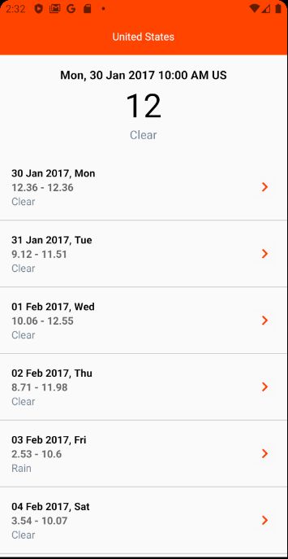

# Weather Forecast

Assessment project for Massive Infinity

## Getting Started

1. This application use [Open Weather Map](https://openweathermap.org/).

2. Works only for Android. It could works on iOS but I am using Linux.

### Prerequisites
1. React-Native cli
2. NodeJs
2. Android Studio / XCode - For emulator / simulator
3. IDE - IntelliJ IDEA

### Running
1. `react-native start`
2. `react-native run-android` for android `react-native run-ios` for iOS.

## Running the tests
1. `jest --collect-coverage` - This will generate coverage files in both lcov and html

## Formatter
1. Run `eslint --fix <directory to ts files>`

## Build with
1. Architecture.
    1. [redux](https://redux.js.org/) - State Management
    2. [hook](https://reactjs.org/docs/hooks-intro.html) - Component Lifecycle
    3. [redux-thunk](https://github.com/reduxjs/redux-thunk) - Async redux
    4. [redux-persist](https://github.com/rt2zz/redux-persist) - persistent storage

2. Services
    1. [fetch](https://javascript.info/fetch) - Network
    
3. etc:
    1. [es-lint](https://eslint.org/) - Linter
    2. [Typescript](https://www.typescriptlang.org/) - Development language
    3. [Jest](https://jestjs.io/) - Unit tests

## Screenshots




## Development environment

```
react-native --version 3.2.1
```

## Authors

* [**Yusuf Rosman**](https://github.com/zaralockheart)

## License

This project is licensed under the MIT License - see the [LICENSE.md](LICENSE) file for details

## Acknowledgments
* I am just a developer who keen to explore and get better at what I am doing.

## Requirement for Assessment

- [x] Connecting and retrieval of data from API.
- [x] Performing validations and showing error messages appropriately.
- [x] Integration with third-party libraries.
- [ ] Implementing best practises of React Native.

## Scoring criteria
- [x] Accurate user interface
- [ ] Presentable on all iPhone and Android devices.
- [x] Implementation of React Native best practices, e.g. reusable codes that can be use
repetitively, in different screens, projects, or by other team members.
- [ ] Structured and clean codes

## Also looking
- [x] Implementation of custom fonts
- [ ] Implementation of local database, e.g. SQLite

## Note.
1. I am using Ubuntu as my development for this assessment, iOS could be a problem to run.
2. I am not too sure if redux-persist is consider as local database but this is what I choose.
3. I didn't tick structure and clean codes since this codebase is purely written by me
without peer review. I don't have any saying on this matter. 
4. I didn't tick implementing best practises of React Native as I am not sure 
if this is the best practice.
5. This app is using sample open weather api https://samples.openweathermap.org/data/2.5/forecast/daily?lat=35&lon=139&cnt=10&appid=f5494a7c084b83729a1ef81f70d182f6
as from what I read, the api that return weather forecast I not available on free tier.
6. Do let me know if some of the thing that I didn't tick should be tick and if those 
that I tick should not be ticked.
7. I don't see any font that is required, so I picked Sarpanch without any reason why.


